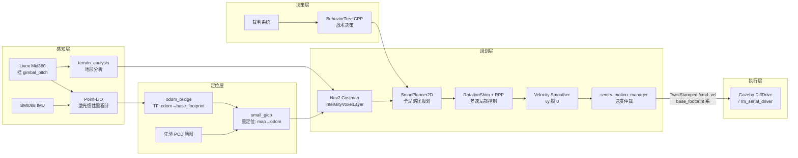

[](https://opensource.org/licenses/Apache-2.0)


# Sentry26 - ROS2 哨兵导航系统

RoboMaster 2026 赛季哨兵机器人自主导航系统。基于 ROS2 Jazzy + Nav2 + BehaviorTree.CPP，支持差速轮足底盘、Livox Mid360 激光雷达、Gazebo Harmonic 仿真。

## 系统架构



### 速度指令链路

```
controller_server (base_footprint 系, TwistStamped)
  → velocity_smoother (vy 锁 0, TwistStamped)
    → /cmd_vel_nav
      → sentry_motion_manager (输出使能, 仲裁后发布最终 /cmd_vel)
        ├─► Gazebo DiffDrive 插件
        └─► rm_serial_driver → 串口下发 (vel_x, vel_w)
```

差速底盘 `chassis_yaw ≡ base_footprint_yaw`，无需坐标旋转。

### TF 树（6 层）

```
map → odom → base_footprint → chassis → gimbal_yaw → gimbal_pitch → front_mid360
```

- `base_footprint` 为 Nav2 的 `robot_base_frame`（业界惯例，水平 2D 投影点）。
- 当前实车 profile 中，`gimbal_yaw → gimbal_pitch` 与底盘是静态 TF；仿真 profile 仍保留动态云台关节。
- LiDAR 挂在 `gimbal_pitch` 上；实车当前为固定 15° 下俯安装，odom_bridge 继续统一通过 TF 查询消化该外参。

## 功能特性

- **差速轮足导航**：RPP + RotationShim 控制器组合，Nav2 官方差速默认
- **高频定位**：Point-LIO 激光惯性紧耦合 + small_gicp 全局重定位
- **地形感知**：基于 intensity 的体素代价地图层，支持坡道/台阶检测
- **行为决策**：BehaviorTree.CPP 行为树，支持进攻/防守/补给/巡逻状态切换
- **云台独立**：Nav2 不控云台；云台由下位机和视觉/自动瞄准直接驱动，与导航正交
- **完整仿真**：Gazebo Harmonic 全场景仿真，含裁判系统、多机器人对抗
- **工具链**：串口 Mock、地图坐标拾取、实时数据可视化

## 目录结构

自研包与第三方上游代码分离，便于维护和同步。

```
src/
├── sentry_nav/                       # 自研导航栈
│   ├── odom_bridge/                  #   里程计桥接 + 云台雷达 TF 查询
│   ├── nav2_plugins/                 #   IntensityVoxelLayer（BackUpFreeSpace 保留但不在默认恢复路径）
│   └── small_gicp_relocalization/    #   全局重定位节点
├── sentry_nav_bringup/               # Launch 文件、Nav2 参数、地图、行为树 XML
├── sentry_motion_manager/            # 底盘速度仲裁，Nav2 输出 cmd_vel_nav → 最终 /cmd_vel
├── sentry_behavior/                  # BehaviorTree.CPP 行为树插件
├── sentry_robot_description/         # 机器人模型（wheeled_biped_real/sim + shared core）
├── serial/                           # rm_serial_driver 串口通信 + 协议生成器
├── rm_interfaces/                    # 统一自定义消息（裁判系统 + 视觉）
├── sentry_tools/                     # 调试工具（串口 Mock / 地图拾取 / 数据可视化）
├── third_party/                      # 上游第三方代码（保持 upstream 同步）
│   ├── point_lio/                    #   Point-LIO 激光惯性里程计
│   ├── terrain_analysis*/            #   CMU terrain_analysis 系列
│   ├── livox_ros_driver2/            #   Livox 官方雷达驱动
│   ├── pointcloud_to_laserscan/      #   ROS2 点云→2D scan
│   ├── ign_sim_pointcloud_tool/      #   仿真点云格式转换
│   └── BehaviorTree.ROS2/            #   BT-ROS2 集成框架
├── simulator/                        # Gazebo Harmonic 仿真环境（rmoss_* 体系）
│   ├── rmoss_core/                   #   仿真基础库
│   ├── rmoss_gazebo/                 #   仿真插件
│   ├── rmoss_gz_resources/           #   场地模型资源
│   ├── rmu_gazebo_simulator/         #   RoboMaster 仿真器启动包
│   └── sdformat_tools/               #   SDF 工具
├── scripts/                          # 环境配置脚本
└── docs/                             # 项目文档
```

## 环境要求

| 依赖 | 版本 |
|------|------|
| Ubuntu | 24.04 LTS |
| ROS2 | Jazzy |
| Gazebo | Harmonic (gz-sim 8) |
| C++ | C++17 |
| Python | 3.12+ |
| 硬件 | Livox Mid360 + 差速轮足底盘 + BMI088 IMU |

## 编译

```bash
# 方式一：一键配置环境（推荐首次使用）
bash src/scripts/setup_env.sh

# 方式二：手动编译
rosdep install -r --from-paths src --ignore-src --rosdistro jazzy -y
pip3 install xmacro --break-system-packages
colcon build --symlink-install --cmake-args -DCMAKE_BUILD_TYPE=Release
source install/setup.bash
```

## 快速开始

### 仿真模式（两终端启动）

仿真环境下导航栈对启动时序敏感（Gazebo 未 unpause 时没有传感器数据 → Point-LIO 无法初始化），因此**必须分两个终端启动**：

```bash
# === 终端 1：启动 Gazebo（可选 headless:=true 无 GUI） ===
QT_QPA_PLATFORM=xcb ros2 launch rmu_gazebo_simulator bringup_sim.launch.py

# 等待机器人 spawn 完成后 unpause Gazebo：
gz service -s /world/default/control \
  --reqtype gz.msgs.WorldControl --reptype gz.msgs.Boolean \
  --timeout 5000 --req 'pause: false'

# 再等 ~10 秒让仿真时钟稳定、传感器数据开始流动

# === 终端 2：启动导航栈 ===
# 首次跑（无先验地图，实时 SLAM 建图）：
ros2 launch sentry_nav_bringup rm_navigation_simulation_launch.py \
  world:=rmuc_2026 slam:=True

# 有图后切换到纯导航模式：
ros2 launch sentry_nav_bringup rm_navigation_simulation_launch.py \
  world:=rmuc_2026 slam:=False
```

> 两步分离而非一键 launch 的原因：Gazebo spawn 完成到传感器流稳定需要 ~10s，将导航栈一起 TimerAction 容易在慢机器上时序错位（Point-LIO 收不到 IMU 初始化失败），分开手动控制更可靠。

### 实车模式

实车端**零代码改动，仅配置即可部署**。

```bash
# 首次建图（实车走一圈，建出 2D 地图和 PCD 点云）
ros2 launch sentry_nav_bringup rm_sentry_launch.py slam:=True

# 导出地图和 PCD（建图完成后）
ros2 run nav2_map_server map_saver_cli -f <save_name>
# PCD 保存由 Point-LIO 节点退出时自动执行

# 有图后导航
ros2 launch sentry_nav_bringup rm_sentry_launch.py world:=<map_name> slam:=False
```

**跨团队协作事项**：

- 下位机固件需升级到 2026 赛季版：
  - `src/serial/serial_driver/protocol/protocol.yaml` 已新增 `chassis_yaw/pitch` + `gimbal_yaw/pitch` 四路姿态字段
  - imu 包二进制布局从 11B → 27B
  - 电控端需用新版 `src/serial/serial_driver/example/navigation_auto.h` 重编固件

- 实车 TF 与传感器安装外参在 `src/sentry_robot_description/resource/xmacro/wheeled_biped_real.sdf.xmacro` 调整；当前实车默认是固定云台 + Mid360 下俯 15°。仿真专用底盘缩小、caster、DiffDrive 和 Mid360 下俯角只在 `wheeled_biped_sim.sdf.xmacro` 调整；共享轮距/轮径/云台拓扑位于 `wheeled_biped_core.sdf.xmacro`。

## 主要参数

| 参数 | 说明 | 默认值 |
|------|------|--------|
| `namespace` | 机器人命名空间 | `""` |
| `slam` | SLAM 建图模式 | `False` |
| `world` | 仿真世界名称 | `""` |
| `use_sim_time` | 仿真时间 | `False` |
| `use_rviz` | 启动 RViz | `True` |
| `headless` | Gazebo 无 GUI | `False` |

## 调试工具

```bash
# 串口 Mock + 地图坐标拾取（独立于 ROS）
python3 src/sentry_tools/sentry_toolbox.py

# 串口数据实时可视化（需 ROS 环境）
source install/setup.bash
python3 src/sentry_tools/serial_visualizer.py
```

详见 [sentry_tools 文档](src/sentry_tools/README.md)。

## 文档

| 文档 | 说明 |
|------|------|
| [快速部署指南](src/docs/QUICKSTART.md) | 从零开始的环境搭建与首次运行 |
| [系统架构详解](src/docs/ARCHITECTURE.md) | 各模块数据流、坐标系、接口设计 |
| [运行模式说明](src/docs/RUNNING_MODES.md) | 仿真/实车/建图/导航模式详解 |
| [参数调优指南](src/docs/TUNING_GUIDE.md) | Point-LIO / Nav2 / 控制器参数调优 |
| [远程调试指南](src/docs/REMOTE_DEBUG.md) | Foxglove 远程可视化配置 |

## 致谢

本项目基于 [深圳北理莫斯科大学 PolarBear 战队 pb2025_sentry_nav](https://github.com/SMBU-PolarBear-Robotics-Team/pb2025_sentry_nav) 重构。

## 许可证

Apache-2.0（遵循原项目许可证；原作者版权与署名保留在 `package.xml` 的 `<author>` 字段）
