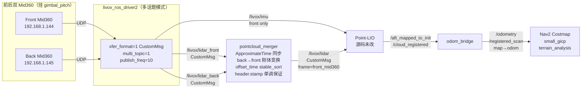
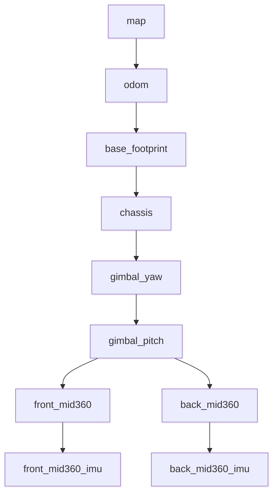

# sentry_dual_mid360 Architecture

> **Maintainer**: Boombroke <boombroke@icloud.com>
> **Scope**: 包级权威架构文档。描述双 Mid360 前后反向融合方案的架构、硬件、配置、同步、标定、融合节点、Point-LIO 零改动集成、TF 布局、launch 路径、验证与故障排查。
> **定位**: 本文只讲本包视角，是工程落地说明；项目级总体架构参见仓库根 `src/docs/ARCHITECTURE.md`，双 Mid360 升级的知识点与工程守则参见仓库根 `AGENTS.md`。不重复上游 Point-LIO/Livox SDK 的通用介绍。

---

## 1. Background and Design Goals

单 Mid360 布局的问题：Mid360 非重复扫描模式的水平 FOV 在单颗时覆盖前方半球，车尾约 160° 是盲区。赛场上需要同时处理前方远距目标和近身围攻，**单雷达的后向盲区直接等于被偷袭概率**。同时仅靠前向低线束也很难稳定检测低矮障碍。

本包要达成的目标（按优先级）：

1. **互补盲区**：前后反向两颗 Mid360，覆盖全周；两颗都固定到 `gimbal_pitch` 下，随云台同步运动，避免底盘偏航带来的视野漂移。
2. **Point-LIO 零源码改动**：绝不 fork Point-LIO。融合发生在 Point-LIO 之前，以 `livox_ros_driver2/CustomMsg` 的格式交给 Point-LIO 的订阅端；LIO 当黑盒处理。
3. **外参唯一真相源**：所有 Mid360 外参（`extrinsic_T/R`）和重力向量只来源于 xmacro（机械 CAD 位姿）。不允许手写 YAML、不允许环境变量或 JSON 作为第二真相源。
4. **向后兼容单雷达**：`use_dual_mid360:=False` 时 merger 不启动、生成的 Point-LIO override YAML 不加载、dual 驱动 JSON / override / per-device remap 均不注入；Livox driver 走基础 `configured_params`（单雷达默认），Point-LIO 保持基础 YAML 的 `common.lid_topic: livox/lidar`，回到单 Mid360 链路。
5. **硬件同步优先**：header.stamp 必须源自同一硬件时钟；严禁在 merger 或 Point-LIO 里做软件补偿来隐藏同步缺陷。

非目标：本包不做 SLAM、不做 costmap 插件、不做局部控制器；不替换 Point-LIO，不替换 `small_gicp_relocalization`。

---

## 2. High-Level Architecture



关键边界：

- **Merger 以上**：硬件 + Livox 驱动。dual 模式使用 `multi_topic=1 + xfer_format=1`，发布 `/livox/lidar_front`、`/livox/lidar_back`、`/livox/imu`（front IMU 路由）。
- **Merger 内部**：`sentry_dual_mid360::MergerNode` 做四件事——同步、后向几何变换到前雷达系、按 `offset_time` `std::stable_sort`、强制 `header.stamp` 单调。
- **Merger 以下**：Point-LIO 只看到一路 `/livox/lidar`（CustomMsg，`frame_id=front_mid360`），行为与单雷达完全一致；下游 odom_bridge / terrain_analysis / small_gicp / Nav2 对单/双雷达拓扑无感。
- **Back IMU**：Point-LIO 只消费 front IMU。Back IMU 仅作诊断（话题 `/livox/imu_back`），不进 LIO 状态估计，避免双 IMU 冲突。

---

## 3. Hardware and IP Layout

| 设备 | 角色 | IP | 端口 (cmd/push/point/imu/log) | 主机端口 | 备注 |
|------|------|------|------------------------------|----------|------|
| Front Mid360 | 主雷达 + IMU 源 | `192.168.1.144` | 56100 / 56200 / 56300 / 56400 / 56500 | 56101 / 56201 / 56301 / 56401 / 56501 | IMU 进 Point-LIO |
| Back Mid360 | 补盲 + 诊断 IMU | `192.168.1.145` | 同上 | 同上 | IMU 仅诊断，不进 LIO |
| 主控 (Jetson / x86) | ROS2 主机 | `192.168.1.100` | N/A | N/A | driver 与 merger 所在主机 |

两颗 Mid360 的 `extrinsic_parameter` 在驱动 JSON 中**全部归零**；真正的物理外参由 xmacro → TF 决定（本包 `urdf/` + `sentry_robot_description/resource/xmacro/wheeled_biped_real.sdf.xmacro`），Point-LIO 内部 `extrinsic_T/R` 由 codegen 从 xmacro 派生。驱动侧不重复写外参是为避免第二真相源。

---

## 4. Livox Driver Configuration

dual 模式的驱动配置集中在 `config/mid360_user_config_dual.json` 与 `config/livox_driver_dual_override.yaml`：

- `mid360_user_config_dual.json`：两条 `lidar_configs`，分别指向 `.144` 与 `.145`；`pcl_data_type=1`（CustomMsg），`pattern_mode=0`（非重复扫描），`extrinsic_parameter` 全零。
- `livox_driver_dual_override.yaml`：
  - `xfer_format: 1` — 必须是 CustomMsg，保留逐点 `offset_time / reflectivity / tag / line`。
  - `multi_topic: 1` — 一台雷达一个话题，名字由 IP 决定（launch 侧把 `.144 → /livox/lidar_front`、`.145 → /livox/lidar_back` 做 topic remap）。
  - `publish_freq: 10.0` — 双雷达 CPU 预算上限，不能再往上抬。
  - `frame_id: mid360` — 通用占位，具体 frame 由 xmacro TF 决定。
  - `user_config_path` 指向上面的 dual JSON。

这两份配置单独放在本包 `config/` 下，不被合并进 `sentry_nav_bringup/config/reality/nav2_params.yaml` 的单雷达默认，避免 `use_dual_mid360:=False` 时被污染。

---

## 5. Hardware Time Sync

Point-LIO 信 `msg->header.stamp`，`timebase` 字段被忽略。两颗 Mid360 必须源自同一个硬件时钟，否则 merger 的 `ApproximateTime(slop=10ms)` 会在几十分钟内失配，融合结果退化成单雷达。

Livox 官方仅支持三种硬件同步方式：**PTP (IEEE 1588v2) / gPTP / GPS 模式（PPS + GPRMC UART）**。

本文不复制具体接线与验证步骤；操作员必须按同目录 [`SYNC_VERIFICATION.md`](SYNC_VERIFICATION.md) 走完四步法：

1. SDK2 / Viewer 查询当前 time sync source。
2. 核对物理接线（PTP 主时钟或 PPS + GPRMC）。
3. 跑 `scripts/verify_dual_mid360_sync.py` 采样 header.stamp 对齐情况。
4. 按结果判定 `HARDWARE_SYNC / DRIFTING / NOT_SYNCED`。

**规则**：硬件不同步就修硬件。禁止在 merger / Point-LIO 里做时间补偿。

---

## 6. Extrinsic Calibration (Multi_LiCa)

外参流程与写入规则：

1. **CAD 默认值**：`src/sentry_robot_description/resource/xmacro/wheeled_biped_real.sdf.xmacro` 定义
   - `front_lidar_pose="-0.17 0 0.10 0.0 0.5235987755982988 3.141592653589793"`（前雷达下俯 30°、yaw π 反装）
   - `back_lidar_pose="0.05 0 0.05 0.0 0.5235987755982988 3.141592653589793"`（后雷达 yaw π 反向，保持与前对称的下俯角）
2. **标定工具**：Multi_LiCa 离线标定（依赖 teaserpp_python / open3d / pandas）。入口脚本：`scripts/calibrate_dual_mid360.sh`。命令形如
   ```bash
   scripts/calibrate_dual_mid360.sh --check-deps
   scripts/calibrate_dual_mid360.sh --bag <calib_bag_dir> --output-report <path> [--write-xmacro]
   ```
3. **写回规则（MH8，强制）**：脚本 **不会** 修改 xmacro，除非同时满足三个条件：
   (1) 成功解析 Multi_LiCa 报告得到数值误差；
   (2) `translation_error_cm < 2.0` **且** `rotation_error_deg < 0.5`；
   (3) 操作员显式传 `--write-xmacro`。
   任一条件不满足，保留 CAD 默认值，不得强行落盘。
4. **派生参数自动更新**：xmacro 改动后，`colcon build --packages-select sentry_dual_mid360` 自动触发 codegen（见 §8），Point-LIO 的 `extrinsic_T/R` 与 `gravity` 同步刷新。禁止绕过 codegen 直接手改 override YAML。

**本地状态**：Multi_LiCa + teaserpp_python 在当前 workspace 仍未完全落地（open3d / pandas / TEASER++ 未安装）。`--check-deps` 会把这些缺失项标记为 BLOCKED 并给出修复指令；live 标定分支是 fail-stop placeholder，没有解析到真数值前绝不声称 PASS。详见 notepad T11 的安全不变量检查。

---

## 7. pointcloud_merger Node

位置：`src/merger_node.cpp` + `include/pointcloud_merger/merger_node.hpp`。

### 7.1 订阅与发布

| 方向 | Topic | 类型 | 备注 |
|------|-------|------|------|
| Sub | `/livox/lidar_front` | `livox_ros_driver2/CustomMsg` | front Mid360 raw |
| Sub | `/livox/lidar_back`  | `livox_ros_driver2/CustomMsg` | back Mid360 raw |
| Pub | `/livox/lidar`       | `livox_ros_driver2/CustomMsg` | 融合结果，`frame_id=front_mid360` |

参数由 `config/pointcloud_merger_params.yaml` 提供：
`front_topic / back_topic / output_topic / common_frame / back_frame / sync_tolerance_ms / min_dist_front_m / min_dist_back_m / queue_size / tf_cache_retry_count / tf_cache_retry_interval_ms`。

### 7.2 合并规则（Point-LIO 黑盒约束）

Merger 严格遵守 Point-LIO 源码隐含约定，任意一条被破坏都会导致 LIO 发散或丢点：

1. **header.stamp 单调递增**：否则 Point-LIO 触发 `lidar loop back`，整包丢弃；重复时间戳必须 nudge 1ns 而非透传。
2. **`timebase=0`**：Point-LIO 的 `livox_pcl_cbk` 不读 `timebase`，保留会引入歧义。
3. **保留 `tag / reflectivity / line` 字段**：Point-LIO 的 `preprocess.cpp` 用 `(tag & 0x30) == 0x10` 过滤；字段丢失 → 合法点被误杀。
4. **back `line` 保持 0–3**：不要偏移到 4–7 来绕过 `scan_line=6` 过滤，否则 Point-LIO 直接丢 `line >= scan_line` 的点。
5. **按 `offset_time` `std::stable_sort`**：Point-LIO EKF 对点级时间单调敏感。
6. **native-frame min-distance 过滤**：在 back 点云**原生系**做 min-distance 裁剪（`min_dist_back_m`），不要等变换到前雷达系后再按欧氏距离裁剪，几何语义会错位。

### 7.3 同步策略

`message_filters::ApproximateTime`，默认 `slop=10ms`（由 `sync_tolerance_ms` 控制）。在硬件同步健康的前提下，典型时间差远小于 slop；如果持续有 `drop_sync_` 计数累积，先查 §5 硬件同步，再动 slop。

### 7.4 性能预算与剖析

提供 `scripts/qa_merger_latency.py`：

- 默认 mock 模式不依赖硬件，生成 CustomMsg 形状点云，计时三个热点（min-distance 过滤 / back→front 刚体变换 / stable_sort）。
- `--live-pid <pid>` 可在真机上采集 merger_node 的 CPU/RSS。
- 阈值由 `--max-median-ms / --max-p99-ms` 控制；默认种子 `20260506` 保证 CI 可复现。

规则：mock 数据绝不能报告为实车/Jetson 延迟；没有 live 话题就把 runtime profiling 标记为 BLOCKED，参见 notepad T20。

---

## 8. Point-LIO Zero-Modification Integration

Point-LIO 源码不修改。所有改动在外部以参数覆盖与话题改道完成。

### 8.1 参数覆盖层（build-time codegen）

`scripts/generate_pointlio_overrides.py` 在 `colcon build --packages-select sentry_dual_mid360` 期间被 CMake `add_custom_command` 触发，只读两个 xmacro 输入：

- **Layer A**：`wheeled_biped_real.sdf.xmacro` 的 `front_lidar_pose` → 决定 `mapping.gravity` 与 `gravity_init`（CAD 下俯角 30°）。
- **Layer B**：`urdf/mid360_imu_tf.sdf.xmacro` 的 IMU factory pose → 决定 `extrinsic_T / extrinsic_R`（Mid360 出厂 IMU 相对 LiDAR 位姿 `-0.011 -0.02329 0.04412 0 0 0`）。

输出安装到：

```text
install/sentry_dual_mid360/share/sentry_dual_mid360/config/pointlio_dual_overrides.yaml
```

**硬规则**：

- 该 YAML 是 build 产物，**不在源码 `config/` 提交，禁止手编辑**。
- 输入缺失或非法（如无法解析的 xmacro pose）→ 生成器立刻失败，不写出 YAML。
- 禁止从环境变量、JSON、文档或远端接口读取外参作为第二真相源。
- `scripts/verify_pointlio_overrides_fresh.py` 是 CI/台架门控：对当前 xmacro 输入重算一次，与安装 YAML 做字段级 diff，不一致就拒绝放行。

### 8.2 运行时话题改道

在 `sentry_nav_bringup` 里通过 `IfCondition(use_dual_mid360)` / `UnlessCondition(...)` 两个互斥 Point-LIO Node 实现：

- `use_dual_mid360:=True`（默认）：启动 merger 和 dual Point-LIO node，后者以 `configured_params` + `pointlio_dual_overrides.yaml` + `{"common.lid_topic": "livox/lidar"}` 覆盖单雷达默认；`lifecycle_nodes` 只含 `map_server`，merger 是普通 `Node`，不是 Nav2 lifecycle node。
- `use_dual_mid360:=False`：不启动 merger，不加载生成的 override YAML，不在 Point-LIO 节点 parameters 列表里注入任何 `common.lid_topic` 覆盖；Point-LIO 沿用基础 YAML 里的 `common.lid_topic: livox/lidar`，由基础单雷达 Livox driver 发布该话题，等价于升级前的单 Mid360 链路。

### 8.3 源码保持 upstream 清洁

在任意 Point-LIO `src/*.cpp / *.hpp` 中做改动都会破坏"零改动"契约，并让 upstream 合并产生冲突。如果需要表达新的行为，必须走：参数覆盖 → 外部节点（merger / 诊断节点） → 第三方分支托管的前提下再评估 fork。

---

## 9. TF Tree and Frame Conventions



要点：

- 两颗 Mid360 都挂 `gimbal_pitch`，随云台同步运动；`base_footprint` 对 Nav2 来说感知不到云台旋转（odom_bridge 每帧 `lookupTransform(lidar_frame → base_frame)` 消化云台外参）。
- `back_mid360` 通过 yaw=π 实现物理反向安装，TF fragment 由本包 `urdf/back_mid360.sdf.xmacro` 提供（跨包 `xmacro_include` 由 `sentry_robot_description` 调用，见根 `AGENTS.md` §9）。
- `*_mid360_imu` 是 IMU 出厂 anchor（Layer B）；`front_mid360_imu` 的变换是 Point-LIO `extrinsic_T/R` 的派生源，`back_mid360_imu` 仅诊断用，不进 LIO。
- `common_frame` / merger `output` frame 固定为 `front_mid360`；Point-LIO 以该 frame 读取点云并在内部维护 `camera_init`。

---

## 10. Launch Integration

`use_dual_mid360` 是 launch 顶层开关，默认 `True`。关键路径：

| Launch | 作用 | 关键 wiring |
|--------|------|-------------|
| `pointcloud_merger_launch.py`（本包） | 启动 merger_node，读取 `pointcloud_merger_params.yaml`；支持 `namespace / use_sim_time / params_file` override | 只做 merger，不做 LIO/驱动 |
| `sentry_nav_bringup/launch/bringup_launch.py` | 顶层 bringup，把 `use_dual_mid360` 同时透传给 slam 与 localization 两个分支 | `declare_use_dual_mid360_cmd` + `launch_arguments` |
| `sentry_nav_bringup/launch/localization_launch.py` | 默认导航分支（`slam:=False`） | 互斥 Point-LIO Node，`IfCondition/UnlessCondition`；dual 分支 include `pointcloud_merger_launch.py` 并注入 `pointlio_dual_overrides.yaml` |
| `sentry_nav_bringup/launch/slam_launch.py` | 建图分支（`slam:=True`） | 同上 |
| `sentry_nav_bringup/launch/rm_sentry_launch.py` / `rm_navigation_reality_launch.py` | 实车一键 | 把 `use_dual_mid360` 默认为 `True`；回滚到单雷达传 `use_dual_mid360:=False` |

典型调用：

```bash
# 实车建图（双 Mid360 默认）
ros2 launch sentry_nav_bringup rm_sentry_launch.py slam:=True use_dual_mid360:=True

# 实车导航（有图后）
ros2 launch sentry_nav_bringup rm_sentry_launch.py \
  slam:=False world:=rmuc_2026_dual use_dual_mid360:=True

# 单雷达回滚
ros2 launch sentry_nav_bringup rm_sentry_launch.py slam:=True use_dual_mid360:=False
```

---

## 11. Validation and QA Scripts

本包脚本集中在 `scripts/`，目前可用或在位的工具：

| 脚本 | 目的 | 依赖硬件？ |
|------|------|-----------|
| `calibrate_dual_mid360.sh` | Multi_LiCa 外参标定 + xmacro 安全写回 | 需要 bag + Multi_LiCa 依赖 |
| `verify_dual_mid360_sync.py` | 采样 header.stamp 判定 HARDWARE_SYNC / DRIFTING / NOT_SYNCED | 需要双雷达在线 |
| `record_calib_bag.sh` | 录制标定 bag（CustomMsg） | 需要双雷达在线 |
| `test_real_dual_mid360_static.sh` | 台架静态 smoke（话题、频率、TF） | 需要双雷达在线 |
| `test_sim_dual_mid360.sh` | 仿真 smoke（见 §13 已知阻塞） | 需要 Gazebo 双雷达桥 |
| `qa_odom_bridge_dual.py` | odom_bridge 在 dual 模式下的输出校验 | 需要栈在跑 |
| `qa_merger_latency.py` | merger 热点时延（mock 或 live） | mock 可无硬件 |
| `qa_terrain_coverage.py` | terrain_analysis / ext 覆盖率 | 需要栈在跑 |
| `analyze_map_odom_stability.py` | `map→odom` TF 抖动采样 | 需要栈在跑 |
| `analyze_static_drift.py` | 静态漂移分析 | 需要双雷达在线 |
| `generate_pointlio_overrides.py` | codegen（build 时触发） | 无 |
| `verify_pointlio_overrides_fresh.py` | override YAML 新鲜度门控 | 无 |

规则：所有 QA 脚本遵守 `0=PASS / 1=FAIL / 2=BLOCKED / 3=USAGE` 退出码；没有硬件时走 BLOCKED，不得把 mock 结果伪装成实车证据。

---

## 12. Troubleshooting

以下故障场景按出现频率排序；每条都给出现场可直接执行的命令。

### 12.1 Point-LIO 报 `lidar loop back` 或点云稀疏

- 根因：merger 输出的 `header.stamp` 不单调或重复；或 `offset_time` 没按序整理。
- 命令：
  ```bash
  ros2 topic echo /livox/lidar --field header.stamp | head -40
  ros2 topic hz /livox/lidar
  grep -E "lidar loop back" ~/.ros/log/latest/*point_lio*.log | tail -40
  ```
- 修复：确认 `sync_tolerance_ms` 合理；确认 merger 没被重启风暴挤压；不要从 merger 输出透传 `timebase`。

### 12.2 `drop_sync_` 持续增长 / 融合率低

- 根因：硬件不同步（时钟漂移）或 slop 太小。
- 命令：
  ```bash
  ros2 param get /pointcloud_merger sync_tolerance_ms
  python3 src/sentry_nav/sentry_dual_mid360/scripts/verify_dual_mid360_sync.py --duration 60
  ros2 topic hz /livox/lidar_front /livox/lidar_back
  ```
- 修复：先走 [`SYNC_VERIFICATION.md`](SYNC_VERIFICATION.md) 四步法。**禁止**直接把 slop 抬到几百毫秒来掩盖硬件问题。

### 12.3 `map→odom` 缓慢漂移 / GICP 不收敛

- 根因：PCD 不匹配（单雷达 PCD 用在双雷达上，后半球全 outlier）；或 Point-LIO gravity/extrinsic 参数没跟 xmacro 同步。
- 命令：
  ```bash
  python3 src/sentry_nav/sentry_dual_mid360/scripts/verify_pointlio_overrides_fresh.py
  python3 src/sentry_nav/sentry_dual_mid360/scripts/analyze_map_odom_stability.py \
    --duration 60 --jitter-threshold-cm 10
  # GICP 质量只在日志里（见 §12.5）
  LOG=$(ls -t ~/.ros/log/latest/small_gicp_relocalization*.log | head -1)
  grep -E "inlier_ratio|fitness_error|per_point_error|Emergency" "$LOG" | tail -40
  ```
- 修复：双雷达升级后必须重跑 T21 实车慢速建图，导出**新的** dual-Mid360 PCD；旧单雷达 PCD 不兼容（见 §14 迁移规则）。xmacro 改过就 `colcon build --packages-select sentry_dual_mid360 --cmake-force-configure` 刷 override。

### 12.4 `slam_toolbox` 收不到 scan / `terrain_map` 为空

- 根因：`use_dual_mid360:=True` 时 merger 未启动；或 Point-LIO 未消费 merger 输出 `/livox/lidar`（例如 dual 分支的 `common.lid_topic` 没有覆盖到 `livox/lidar`，导致 scan 流断在上游）。
- 命令：
  ```bash
  ros2 node list | grep -E "pointcloud_merger|point_lio"
  ros2 topic info /livox/lidar
  ros2 param get /laserMapping common.lid_topic
  ```
- 修复：确认 launch 里 `IfCondition(use_dual_mid360)` / `UnlessCondition(...)` 互斥生效；重新 source `install/setup.bash` 避免 stale env。

### 12.5 `/relocalization_diagnostics` 不存在

- 现状：当前 `small_gicp_relocalization` 节点**没有发布** `/relocalization_diagnostics`，只有 `map_clearing` / `cloud_clearing`（T19 finding）。
- 命令（正确姿势 = 读日志）：
  ```bash
  ros2 topic list | grep -E "reloc|small_gicp|map_clearing|cloud_clearing"
  LOG=$(ls -t ~/.ros/log/latest/small_gicp_relocalization*.log | head -1)
  grep -E "inlier_ratio|fitness_error|per_point_error|num_inliers|Emergency" "$LOG" | tail -80
  ```
- 验收阈值（MH4）：`inlier_ratio > 0.5`、`fitness_error < 0.1`、最近 30 秒无 `Emergency relocalization failed`。

### 12.6 Gazebo RTF 下降 / 仿真双雷达跑不起来

- 根因：仿真 dual 链路已经实现；常见问题通常是 Gazebo 未启动/未 unpause、gz→ROS 桥没有前后 PointCloud2、`sim_custommsg_bridge_launch.py` 未启动、`MergerNode` 未收到两路 CustomMsg、或场地阴影导致 RTF 过低。
- 命令：
  ```bash
  ros2 topic list | grep -E "livox|mid360"
  gz topic -l | grep -Ei "livox|mid360|lidar"
  ros2 topic hz /red_standard_robot1/livox/lidar_front_points
  ros2 topic hz /red_standard_robot1/livox/lidar_back_points
  ros2 topic info /red_standard_robot1/livox/lidar_front
  ros2 topic info /red_standard_robot1/livox/lidar_back
  ros2 topic info /red_standard_robot1/livox/lidar
  ```
- 现状：`rmu_gazebo_simulator` 已桥出前后 `gpu_lidar` PointCloud2，本包两份 `SimPointCloudToCustomMsgNode` 会转换成 Livox `CustomMsg` 后喂 `MergerNode`；端到端 Gazebo smoke 仍需在能启动仿真的机器上跑。场地 mesh 的 `<cast_shadows>` 必须 `false`，否则 gpu_lidar 与渲染共管线会拖垮 RTF（见 `AGENTS.md` §9 仿真阴影规则）。

### 12.7 merger 日志打 `drop_front_min_dist_ / drop_back_min_dist_` 很高

- 根因：`min_dist_front_m / min_dist_back_m` 设得过大，或雷达距机身太近。
- 命令：
  ```bash
  ros2 param list /pointcloud_merger
  ros2 param get /pointcloud_merger min_dist_front_m
  ros2 param get /pointcloud_merger min_dist_back_m
  ```
- 修复：确保阈值在雷达**原生系**下合理（一般 `0.3~0.5m`）；不要把它当成"过滤地面"的手段，Point-LIO 有自己的 `preprocess.blind`。

---

## 13. Known Blockers (本地环境)

本包的大量验证项需要真机 + 双雷达 + 先验 PCD，当前开发机不具备：

- **T11（外参标定 live 分支）**：`teaserpp_python / open3d / pandas` 未安装，Multi_LiCa live 执行不通；`--check-deps` 正确报 BLOCKED，xmacro 未被触碰。
- **T15（仿真双雷达）**：`rmu_gazebo_simulator` 的 gz→ROS 桥已切换成 dual 布局（前后 `gpu_lidar` 到 `livox/lidar_front_points` / `livox/lidar_back_points` PointCloud2，前 IMU 到 `livox/imu`，后 IMU 到 `livox/imu_back`）。仿真 dual mode 通过本包 `SimPointCloudToCustomMsgNode` 两实例把 PC2 转成 Livox `CustomMsg` 喂 `MergerNode`，Point-LIO 消费合并后的 `livox/lidar` CustomMsg。实际 Gazebo smoke 仍需在能启动仿真的机器上跑。
- **T16 / T19 / T20 / T21**：无实车双 Mid360、无新版 dual Mid360 PCD、无运行中 nav 栈 → 实机评测、`map→odom` 抖动、merger live 剖析、实车 mapping + PCD 全部 BLOCKED。对应证据是**精确复跑手册**（见 `.sisyphus/evidence/task-21-blocker.md` 等），**不是伪造的 PASS**。

规则（MH11）：**本地没有硬件 ≠ 任务失败**；操作员必须在真机按 blocker 文档复跑，再把 PASS 证据追加回来。不得拿单雷达 PCD / 上游 Point-LIO 样例 PCD 冒充 dual 证据。

---

## 14. PCD Migration (单 → 双 Mid360)

**旧单雷达 PCD 明确不兼容双雷达运行时**。单雷达 PCD 只覆盖前向半球；升级到双 Mid360 后 `registered_scan` 会包含后半球点，若 `small_gicp_relocalization` 仍用旧 PCD 做 target，会产生大量 outlier 匹配，fitness 劣化甚至误收敛。

迁移步骤摘要（详细操作员 SOP 参见仓库根 `src/sentry_nav/sentry_dual_mid360/docs/PCD_MIGRATION.md` —— **该文件由 T22 负责落地**；若当前尚未提交，说明操作员正在 T22 pending）：

1. 确认 T11 外参已 accepted，`pointlio_dual_overrides.yaml` 新鲜（`verify_pointlio_overrides_fresh.py` PASS）。
2. 真机上 `ros2 launch sentry_nav_bringup rm_sentry_launch.py slam:=True use_dual_mid360:=True`，慢速 (<0.3 m/s) 绕场地走一圈，避免撞墙与急速旋转。
3. `ros2 run nav2_map_server map_saver_cli -f ~/Documents/Sentry26_maps/<name>_dual` 保存 2D map。
4. 停 SLAM 栈（Ctrl-C），让 odom_bridge 持续发 `/odom_to_lidar_odom` 直到 Point-LIO 落盘 PCD，保证 PCD 在 odom/map 系（与 `registered_scan` 一致）。
5. 用 `open3d` 统计点数与 AABB（>10 万点、覆盖场地 footprint）；不合格就重走一次。
6. 导航模式回跑 `slam:=False world:=<name>_dual use_dual_mid360:=True`，按 §12.5 抓 GICP 日志做验收；ACCEPTED 后在 Nav Goal smoke 下确认无 `ABORTED`。

禁止：把 `src/sentry_nav_bringup/pcd/simulation/rmul_2026.pcd` 或 `src/third_party/point_lio/PCD/scans.pcd` 等单雷达 / 上游样例 PCD 当双 Mid360 PCD 用；禁止把 PCD 文件提交进 git。

---

## 15. Future Extensions

不构成承诺，仅作收敛目标记录：

- **back IMU 用于诊断冗余**：Point-LIO 仍只吃前 IMU；后 IMU 采样可用于 bias/温漂监控、以及前 IMU 硬件故障时的降级诊断告警，但不进 LIO 状态估计。
- **仿真侧 dual CustomMsg 桥**：已由 `SimPointCloudToCustomMsgNode` + `sim_custommsg_bridge_launch.py` 落地，`rm_navigation_simulation_launch.py` 在 `use_dual_mid360:=True` 时条件启动两实例；端到端 Gazebo smoke 由 `test_sim_dual_mid360.sh` 在能启动仿真的机器上跑。
- **Online extrinsic refinement**：目前 Multi_LiCa 是离线；未来可以引入在线自标定监控漂移，但**写回仍需 MH8 门控**。
- **GICP diagnostics publisher**：把 `small_gicp_relocalization` 的 GICP 质量指标发布到 `/relocalization_diagnostics`（目前只有日志），让 `analyze_map_odom_stability.py` 不必回退到 log grep。
- **Front / Back 视野配比调优**：当前两颗都下俯 30°；如果实测后向掠地需求更高，可改 `back_lidar_pose` 的 pitch，走 xmacro 单源 + codegen，一次 build 同步 `extrinsic_T/R` 与下游参数。

---

## 16. Cross References

- 根 `AGENTS.md` §2 包职责、§4 架构决策、§9 xmacro 单源 / Point-LIO 零改动守则 / MH11 验收规则。
- 本包 [`docs/SYNC_VERIFICATION.md`](SYNC_VERIFICATION.md)：硬件同步四步法、决策流程、PTP / PPS 接线。
- 本包 `docs/PCD_MIGRATION.md`（T22 deliverable，可能尚未提交）：实车 dual-Mid360 PCD 迁移 SOP。
- 本包 `scripts/calibrate_dual_mid360.sh`：Multi_LiCa 外参标定 + 安全 xmacro 写回入口。
- 本包 `scripts/pointcloud_merger` 相关：`qa_merger_latency.py`（剖析）、`verify_dual_mid360_sync.py`（同步门控）、`analyze_map_odom_stability.py`（定位稳定性）。
- 仓库根 `src/docs/ARCHITECTURE.md` / `src/docs/RUNNING_MODES.md` / `src/docs/TUNING_GUIDE.md`：项目级总体架构 / 运行模式 / 参数调优（本文不重复）。
